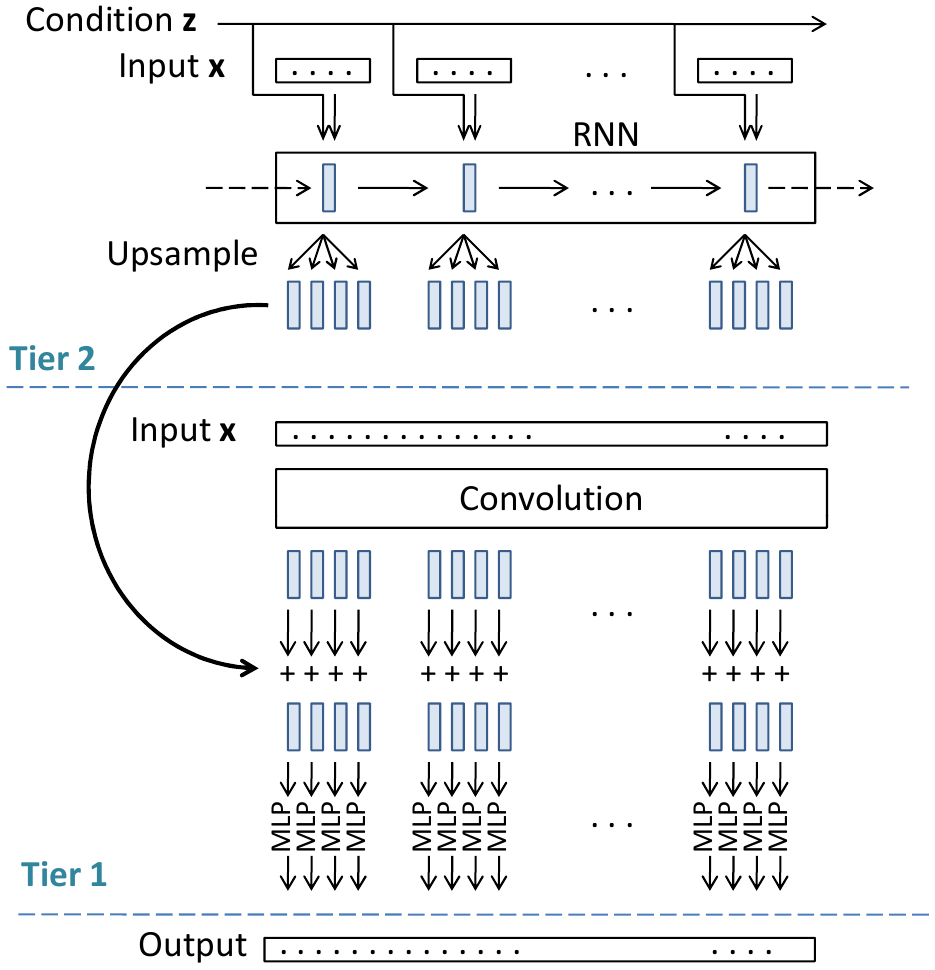

# Acoustic scene generation with conditional SampleRNN (ICASSP 2019)

This codebase implements acoustic scene generation using conditional SampleRNN. We generated 15 kinds of acoustic scenes including such as 'bus' and 'library' trained from the DCASE 2016 Task 1 acoustic scene data. Listen to the generated samples here! https://drive.google.com/open?id=1P_3uQCvM0t22rPtoePv4MNnUcFKWiEuE

## DATASET
The training data is the DCASE 2016 Task 1 acoustic scene data. 

## Run the code

**0. Prepare data** 

We pack the DCASE 2016 Task 1 data to numpy format. First download the packed dataset of numpy data here: https://drive.google.com/open?id=17rbLK3LLLMyCoDuAQISNFelg5DIPoAJB

Create a new folder as your workspace. Put the downloaded dataset folder in this workspace. Later the generated audio samples will also saved to this workspace. 

<pre>
workspace
└── datasets
     ├── audio_train.npz (1.5 GB)
     ├── audio_valid.npz (65 MB)
     └── audio_test.npz (65 MB)
</pre>

**1. Requirements** 

Python 2 + Theano 1.0

**2. Then simply run**

$ WORKSPACE='your/workspace'

$ THEANO_FLAGS=mode=FAST_RUN,device=cuda,floatX=float32 python -u two_tier_spkdird.py --dataset_dir=$DATASET_DIR --workspace=$WORKSPACE --exp AXIS1 --n_frames 64 --frame_size 16 --weight_norm True --emb_size 256 --skip_conn False --dim 1024 --n_rnn 3 --rnn_type GRU --learn_h0 True --q_levels 256 --q_type linear --batch_size 128 --which_set MUSIC

## Model
We apply conditional SampleRNN to generate the audio samples. The architecture looks like:

Input is on the top and output is at bottom. More details can be found in [1]. 

## Results
The training takes around 2 days to train 20 epochs on a single card GTX Titan Xp GPU with 12 GB to get good generation results. the training looks like:

<pre>
...
epoch:16        total iters:91482       wall clock time:35.70h
Lowest valid cost:2.82963466644      Corresponding test cost:2.99329781532
        train cost:2.9226       total time:31.50h       per iter:1.240s
        valid cost:2.8316       total time:0.02h
        test  cost:2.9933       total time:0.00h
Saving params! Done!
Train info saved! And plotted!
Sampling! [ 0  0  0  0  0  0  0  0  0  0  0  0  0  0  0  0  0  0  0  0  1  1  1  1  1
  1  1  1  1  1  1  1  1  1  1  1  1  1  1  1  2  2  2  2  2  2  2  2  2  2
  2  2  2  2  2  2  2  2  2  2  3  3  3  3  3  3  3  3  3  3  3  3  3  3  3
  3  3  3  3  3  4  4  4  4  4  4  4  4  4  4  4  4  4  4  4  4  4  4  4  4
  5  5  5  5  5  5  5  5  5  5  5  5  5  5  5  5  5  5  5  5  6  6  6  6  6
  6  6  6  6  6  6  6  6  6  6  6  6  6  6  6  7  7  7  7  7  7  7  7  7  7
  7  7  7  7  7  7  7  7  7  7  8  8  8  8  8  8  8  8  8  8  8  8  8  8  8
  8  8  8  8  8  9  9  9  9  9  9  9  9  9  9  9  9  9  9  9  9  9  9  9  9
 10 10 10 10 10 10 10 10 10 10 10 10 10 10 10 10 10 10 10 10 11 11 11 11 11
 11 11 11 11 11 11 11 11 11 11 11 11 11 11 11 12 12 12 12 12 12 12 12 12 12
 12 12 12 12 12 12 12 12 12 12 13 13 13 13 13 13 13 13 13 13 13 13 13 13 13
 13 13 13 13 13 14 14 14 14 14 14 14 14 14 14 14 14 14 14 14 14 14 14 14 14]
300 samples of 5 seconds length generated in 265.168148041 seconds. Done!
Validation Done!
...
</pre>

## Citation
[1] Kong, Qiuqiang, Yong Xu, Turab Iqbal, Yin Cao, Wenwu Wang, and Mark D. Plumbley. "Acoustic scene generation with conditional SampleRNN." In Proceedings of the 2019 IEEE International Conference on Acoustics, Speech and Signal Processing (ICASSP 2019), 2019.

## FAQ
If you met running out of GPU memory error, then try to reduce batch_size. 

## License
File evaluation_tools/cls_feature_class.py is under TUT_LICENSE. 

## External link

This implementation is heavily based on the original SampleRNN implementation https://github.com/soroushmehr/sampleRNN_ICLR2017 using Theano. 

We benefit a lot from the PyTorch implementation of SampleRNN https://github.com/deepsound-project/samplernn-pytorch
